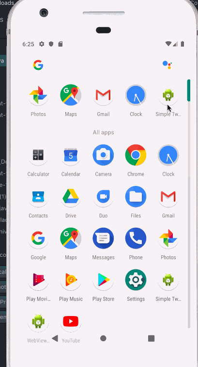

# Project 3 - *Simple Tweet*

**Simple Tweet** is an android app that allows a user to view his Twitter timeline and post a new tweet. The app utilizes [Twitter REST API](https://dev.twitter.com/rest/public).

Time spent: **21** hours spent in total

## User Stories

The following functionality is completed:

* [x]	User can **sign in to Twitter** using OAuth login
* [x]	User can **view tweets from their home timeline**
  * [x] User is displayed the username, name, and body for each tweet
  * [x] User is displayed the [relative timestamp](https://gist.github.com/nesquena/f786232f5ef72f6e10a7) for each tweet "8m", "7h"
* [x] User can **compose and post a new tweet**
  * [x] User can click a “Compose” icon in the Action Bar on the top right
  * [x] User can then enter a new tweet and post this to twitter
  * [x] User is taken back to home timeline with **new tweet visible** in timeline
  * [x] Newly created tweet should be manually inserted into the timeline and not rely on a full refresh

The following **stretch** features are implemented:

* [x] User can **see a counter with total number of characters left for tweet** on compose tweet page
* [x] User is using **"Twitter branded" colors and styles**

The following **bonus** features are implemented:

* [x] User can **click a link within a tweet body** on tweet details view. The click will launch the web browser with relevant page opened.
* [x] User is alerted that they cannot tweet without typing if they attempt to post an empty tweet.
* [x] Word counter turns red when limit is surpassed.
* [x] Tweets are separated by horizontal line.
* [x] Compose tweet button is a floating action button.

## Video Walkthrough

Here's a walkthrough of implemented user stories:

GIF created with [LiceCap](http://www.cockos.com/licecap/).

## Notes

Describe any challenges encountered while building the app.

## Open-source libraries used

- [Android Async HTTP](https://github.com/loopj/android-async-http) - Simple asynchronous HTTP requests with JSON parsing
- [Glide](https://github.com/bumptech/glide) - Image loading and caching library for Android

## License

    Copyright [2019] [Alexei Tulloch]

    Licensed under the Apache License, Version 2.0 (the "License");
    you may not use this file except in compliance with the License.
    You may obtain a copy of the License at

        http://www.apache.org/licenses/LICENSE-2.0

    Unless required by applicable law or agreed to in writing, software
    distributed under the License is distributed on an "AS IS" BASIS,
    WITHOUT WARRANTIES OR CONDITIONS OF ANY KIND, either express or implied.
    See the License for the specific language governing permissions and
    limitations under the License.
